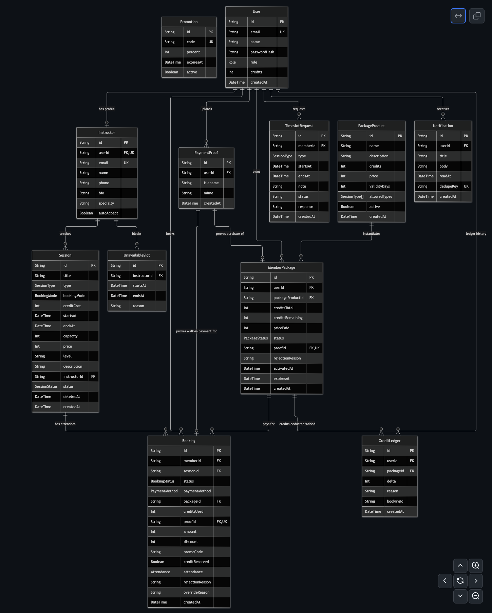
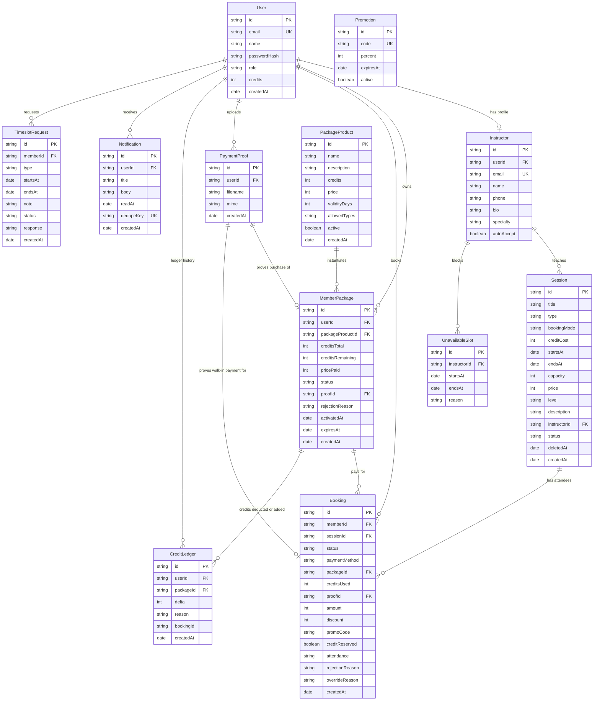

# Dreamtopia Database Documentation & Entity Relationship Diagram (ERD)

This document provides a detailed breakdown of the PostgreSQL schema defined in [`prisma/schema.prisma`](file:///Volumes/SSD/Developement/dreamtopia/backend/prisma/schema.prisma) for Dreamtopia studio management.

---

## 1. Entity Relationship Diagram (ERD)

<b>Click to view Mermaid Diagram Source Code</b>

---

## 2. Enumerations (Enums)

| Enum | Allowed Values | Description |
| :--- | :--- | :--- |
| **`Role`** | `ADMIN`, `INSTRUCTOR`, `MEMBER` | Core access control level for users. |
| **`SessionType`** | `POLE_CLASS`, `TRIAL`, `PRACTICE`, `RENTAL` | Class categories offered by the studio. |
| **`BookingMode`** | `PACKAGE_ONLY`, `WALK_IN_ONLY`, `BOTH` | Determines how a session can be booked (credits vs bank slip). |
| **`SessionStatus`** | `PENDING_INSTRUCTOR`, `SCHEDULED`, `CANCELLED`, `COMPLETED` | Lifecycle states of a scheduled class/slot. |
| **`BookingStatus`** | `PENDING`, `CONFIRMED`, `REJECTED`, `CANCELLED`, `PAID_AWAITING_RESOLUTION` | State of an individual member's seat in a session. |
| **`PackageStatus`** | `PENDING_REVIEW`, `ACTIVE`, `EXHAUSTED`, `EXPIRED`, `REJECTED` | Lifecycle of purchased credit packages. |
| **`PaymentMethod`** | `BANK_TRANSFER`, `CREDITS` | Member payment mechanism. |
| **`Attendance`** | `UNMARKED`, `PRESENT`, `ABSENT`, `NO_SHOW` | Instructor attendance tracking values. |

---

## 3. Detailed Model Reference

### 3.1. `User`
Stores credentials and base account profile for all participants in the platform.

- **`id`** (`String` / UUID, Primary Key): Unique user identifier.
- **`email`** (`String`, Unique): Login email address.
- **`name`** (`String`): User's full name.
- **`passwordHash`** (`String`): Bcrypt-hashed password.
- **`role`** (`Role`, Default: `MEMBER`): Role for RBAC authorization guards.
- **`credits`** (`Int`, Default: `0`): Aggregated balance of available credits.
- **`createdAt`** (`DateTime`): Timestamp when user registered.

---

### 3.2. `Instructor`
Optional 1-to-1 extension of a `User` account containing instructor profile data.

- **`id`** (`String` / UUID, Primary Key): Unique instructor record ID.
- **`userId`** (`String?`, Unique, Foreign Key -> `User.id`): Linked user login account.
- **`email`** (`String`, Unique): Public/contact email.
- **`name`** (`String`): Display name.
- **`phone`** (`String?`): Contact phone number.
- **`bio`** (`String`): Description and teaching history.
- **`specialty`** (`String`): Focus areas (e.g., "Pole flow", "Inversions").
- **`autoAccept`** (`Boolean`, Default: `false`): If true, newly scheduled sessions are automatically confirmed without requiring manual instructor confirmation.

---

### 3.3. `PackageProduct`
Catalog of package templates available for purchase.

- **`id`** (`String` / UUID, Primary Key): Product identifier.
- **`name`** (`String`): Name (e.g. "4-Class Starter Pass").
- **`description`** (`String`): Terms and marketing description.
- **`credits`** (`Int`): Amount of credits granted when purchased.
- **`price`** (`Int`): Cost in base currency units (e.g. MMK).
- **`validityDays`** (`Int`, Default: `30`): Validity window duration once activated.
- **`allowedTypes`** (`SessionType[]`): Array of class types eligible for credit redemption.
- **`active`** (`Boolean`, Default: `true`): Whether the product is available in the store.
- **`createdAt`** (`DateTime`): Timestamp created.

---

### 3.4. `MemberPackage`
Instance of a purchased package owned by a specific member.

- **`id`** (`String` / UUID, Primary Key): Purchased package ID.
- **`userId`** (`String`, Foreign Key -> `User.id`): Owning member.
- **`packageProductId`** (`String`, Foreign Key -> `PackageProduct.id`): Template product.
- **`creditsTotal`** (`Int`): Starting credits.
- **`creditsRemaining`** (`Int`): Credits remaining.
- **`pricePaid`** (`Int`): Actual price paid at purchase time.
- **`status`** (`PackageStatus`, Default: `PENDING_REVIEW`): Current status.
- **`proofId`** (`String?`, Unique, Foreign Key -> `PaymentProof.id`): Uploaded payment slip.
- **`rejectionReason`** (`String?`): Admin rejection note if payment proof is rejected.
- **`activatedAt`** (`DateTime?`): When approved and activated by admin.
- **`expiresAt`** (`DateTime?`): Expiration datetime.
- **Indexes:** `[userId, status]`, `[expiresAt]`.

---

### 3.5. `Session`
A scheduled class, trial, practice, or studio rental on the calendar.

- **`id`** (`String` / UUID, Primary Key): Session ID.
- **`title`** (`String`): Class title.
- **`type`** (`SessionType`): Session type.
- **`bookingMode`** (`BookingMode`, Default: `BOTH`): Payment mode permitted.
- **`creditCost`** (`Int`, Default: `1`): Number of credits required to book.
- **`startsAt`** (`DateTime`): Start time.
- **`endsAt`** (`DateTime`): End time.
- **`capacity`** (`Int`): Maximum attendance limit.
- **`price`** (`Int`): Walk-in bank transfer price.
- **`level`** (`String`, Default: `"All levels"`): Difficulty level.
- **`description`** (`String`): Notes or requirements.
- **`instructorId`** (`String?`, Foreign Key -> `Instructor.id`): Assigned instructor.
- **`status`** (`SessionStatus`): Lifecycle status.
- **`deletedAt`** (`DateTime?`): Soft-delete timestamp.
- **Indexes:** `[startsAt, status]`, `[instructorId, startsAt]`.

---

### 3.6. `UnavailableSlot`
Blocks of time during which an instructor is unavailable.

- **`id`** (`String` / UUID, Primary Key): Block ID.
- **`instructorId`** (`String`, Foreign Key -> `Instructor.id`): Blocked instructor.
- **`startsAt`** (`DateTime`): Block start.
- **`endsAt`** (`DateTime`): Block end.
- **`reason`** (`String`): Reason for time off.
- **Index:** `[instructorId, startsAt]`.

---

### 3.7. `PaymentProof`
Uploaded receipts or screenshots for bank transfer payments.

- **`id`** (`String` / UUID, Primary Key): Proof ID.
- **`userId`** (`String`, Foreign Key -> `User.id`): Uploader.
- **`filename`** (`String`): Stored file name on disk.
- **`mime`** (`String`): MIME type (e.g. `image/jpeg`, `image/png`).
- **`createdAt`** (`DateTime`): Upload timestamp.

---

### 3.8. `Booking`
Records a member's reservation in a session.

- **`id`** (`String` / UUID, Primary Key): Booking ID.
- **`memberId`** (`String`, Foreign Key -> `User.id`): Member booking the seat.
- **`sessionId`** (`String`, Foreign Key -> `Session.id`): Target session.
- **`status`** (`BookingStatus`, Default: `PENDING`): Booking status.
- **`paymentMethod`** (`PaymentMethod`): Credits or bank transfer.
- **`packageId`** (`String?`, Foreign Key -> `MemberPackage.id`): Deducted package (if credits used).
- **`creditsUsed`** (`Int`, Default: `0`): Credits consumed.
- **`proofId`** (`String?`, Unique, Foreign Key -> `PaymentProof.id`): Payment receipt slip.
- **`amount`** (`Int`): Cash amount charged.
- **`discount`** (`Int`, Default: `0`): Discount amount deducted.
- **`promoCode`** (`String?`): Applied coupon code.
- **`creditReserved`** (`Boolean`, Default: `false`): Tracks whether credits were held.
- **`attendance`** (`Attendance`, Default: `UNMARKED`): Attendance status.
- **`rejectionReason`** (`String?`): Rejection note if denied.
- **`overrideReason`** (`String?`): Overcapacity resolution note.
- **Indexes:** `[memberId, status]`, `[sessionId, status]`.

---

### 3.9. `CreditLedger`
Immutable audit log tracking every credit increase and deduction.

- **`id`** (`String` / UUID, Primary Key): Audit entry ID.
- **`userId`** (`String`, Foreign Key -> `User.id`): Member.
- **`packageId`** (`String?`, Foreign Key -> `MemberPackage.id`): Associated package.
- **`delta`** (`Int`): Positive (credits added) or negative (credits spent/refunded).
- **`reason`** (`String`): Explanatory transaction description.
- **`bookingId`** (`String?`): Linked booking ID.
- **`createdAt`** (`DateTime`): Transaction timestamp.
- **Index:** `[userId, createdAt]`.

---

### 3.10. `Promotion`
Discount voucher codes.

- **`id`** (`String` / UUID, Primary Key): Promo record ID.
- **`code`** (`String`, Unique): Uppercase promo string (e.g. `WELCOME20`).
- **`percent`** (`Int`): Percentage discount.
- **`expiresAt`** (`DateTime`): Expiration datetime.
- **`active`** (`Boolean`, Default: `true`): Active flag.

---

### 3.11. `Notification`
User notifications for in-app alert feeds.

- **`id`** (`String` / UUID, Primary Key): Notification ID.
- **`userId`** (`String`, Foreign Key -> `User.id`): Recipient.
- **`title`** (`String`): Notification header.
- **`body`** (`String`): Message content.
- **`readAt`** (`DateTime?`): Null if unread, timestamp when viewed.
- **`dedupeKey`** (`String?`, Unique): Unique key preventing duplicate notifications.
- **`createdAt`** (`DateTime`): Timestamp sent.
- **Index:** `[userId, createdAt]`.

---

### 3.12. `TimeslotRequest`
Member-submitted requests for custom class timeslots or private sessions.

- **`id`** (`String` / UUID, Primary Key): Request ID.
- **`memberId`** (`String`, Foreign Key -> `User.id`): Requesting member.
- **`type`** (`SessionType`): Requested session category.
- **`startsAt`** (`DateTime`): Preferred start datetime.
- **`endsAt`** (`DateTime`): Preferred end datetime.
- **`note`** (`String`): Additional requests or notes from member.
- **`status`** (`String`, Default: `"PENDING"`): Status (`PENDING`, `APPROVED`, `DECLINED`).
- **`response`** (`String?`): Admin response message.
- **`createdAt`** (`DateTime`): Timestamp created.
- **Index:** `[memberId, status]`.
